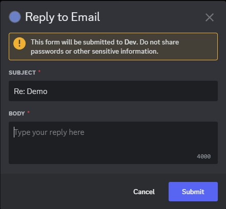

# discord-mail-forwarder

discord-mail-forwarder is a dockerised mail forwarder to discord. It will read out the inbox of an email account, and dump those messages in a channel as an embed. You can also reply to these emails within discord. Multiple emails can be monitored at once. Inspired by [discord-mail-webhook](https://github.com/AshCorr/discord-mail-webhook)




## Configuration

This bot supports watching multiple emails. Configuration wise, this is defined by placing a number incrementally behind the name of an environment variable. For an example, see the docker-compose example

Environment Variable|Default Value|Description
----|----|----
BOT_TOKEN|None|Optional. Sets the discord bot token. If not set, only webhooks can be sent
EMAIL_HOST.{idx}|None|Required if IMAP_HOST/SMTP_HOST is not set. Sets the SMTP and IMAP host.
IMAP_HOST.{idx}|None|Required if EMAIL_HOST is not set. Sets the IMAP host.
SMTP_HOST.{idx}|None|Required if EMAIL_HOST is not set. Sets the SMTP host.
EMAIL_USER.{idx}|None|Required. Sets the email to login with.
EMAIL_PASS.{idx}|None|Required. Sets the password to login with.
DISCORD_CHANNEL_ID.{idx}|None|Optional. Sets the discord channel to send messages in. Requires having BOT_TOKEN set
DISCORD_CHANNEL_WEBHOOK.{idx}|None|Optional. Sets the discord webhook to send messages to.
DISCORD_ROLE_ID.{idx}|None|Optional. Users must have the specified role id to reply to an email.
SMTP_PORT.{idx}|589|Optional. Sets the port of the SMTP server. Uses StartTLS
IMAP_PORT.{idx}|993|Optional. Sets the port of the IMAP server.
ALLOW_REPLIES.{idx}|1|Optional. Set to 1 to allow replying from within discord. Set to 0 to disable.

Setting an environment variable without a number behind it (as for example `EMAIL_HOST`) will make it the default value for all configured email accounts.

### Example docker-compose.yml

```yml
version: '3'

services:
  email-listener:
    image: ghcr.io/suchmememanyskill/discord-mail-forwarder:latest
    restart: unless-stopped
    container_name: email-listener
    environment:
      - BOT_TOKEN=my_very_secure_bot_token
      # Default email host
      - EMAIL_HOST=mail.server.com 

      # Email Account 1
      # Uses default EMAIL_HOST
      - EMAIL_USER.1=mudkip@server.com
      - EMAIL_PASS.1=my_very_secure_password
      - DISCORD_CHANNEL_ID.1=1001843557109346365
      # Email Account 2
      # Uses default EMAIL_HOST
      - EMAIL_USER.2=treeco@server.com
      - EMAIL_PASS.2=my_very_secure_password_2
      - DISCORD_CHANNEL_ID.2=1001843557109346365
      - ALLOW_REPLIES.2=0
      # Email Account 3. Will send messages as a webhook
      - EMAIL_HOST.3=mail2.server.com
      - EMAIL_USER.3=torchic@server.com
      - EMAIL_PASS.3=my_very_secure_password_3
      - DISCORD_CHANNEL_WEBHOOK.3=https://discord.com/api/webhooks/0/0
      - ALLOW_REPLIES.3=0
